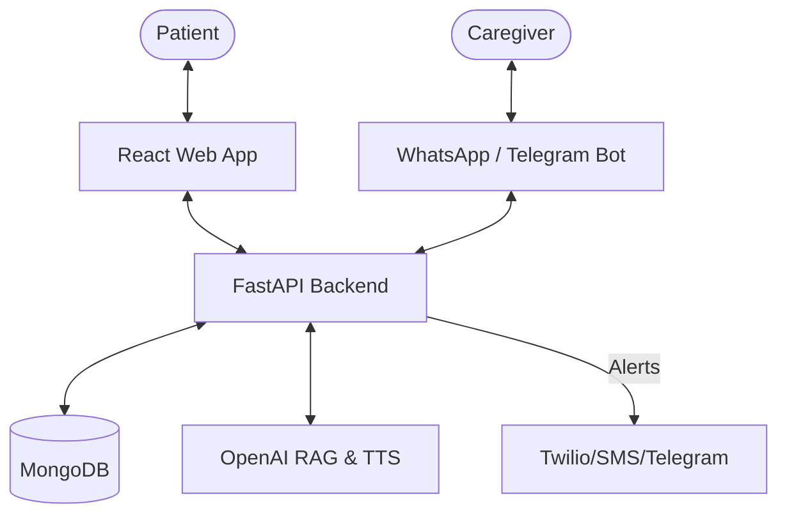

# AlzaHelp: Project Functional Overview

This document provides a comprehensive overview of the **AlzaHelp** (MemoryKeeper) ecosystem, explaining the core functionalities, the technical flow, and how the different modules interconnect to support patients with cognitive challenges and their caregivers.

---

## 🏗️ System Architecture & Data Flow

AlzaHelp is built as a **Full-Stack AI-Native Platform**:

- **Frontend**: React-based Single Page Application (SPA) with a mobile-first, high-accessibility design.
- **Backend**: FastAPI (Python) handles intense logic, asynchronous tasks, and AI integrations.
- **Database**: MongoDB for flexible health and memory data storage.
- **AI Engine**: Hybrid RAG (Retrieval-Augmented Generation) using OpenAI GPT-4o, TTS, and custom lexical search.
- **Communication Layer**: Direct integrations with WhatsApp (Twilio) and Telegram for remote caregiver interaction.

### System Interaction Flow

---

## 🧠 Core Modules & Functionalities

### 1. AI Companion & Agentic RAG

The "heart" of the project. It provides a warm, always-available voice and text assistant for the patient.

- **Functionality**: Answers questions like "Who is Maria?", "What medicine do I take today?", or "Tell me about my trip to Paris."
- **How it works**: When a user asks a question, the backend performs a **Hybrid Retrieval**:
  1. It generates a vector embedding of the user's query (`query_embedding`).
  2. It calculates a hybrid semantic + lexical score against the **Family**, **Memories**, and **Care Instructions** collections.
  3. It retrieval-augments the top results as context for the LLM.
- **Voice Flow**: Wake-word detection ("Hey Mate") -> STT (using either Web Speech API or iOS/Safari fallback via OpenAI Whisper) -> RAG LLM -> TTS (OpenAI Nova voice) -> Patient.

### 2. Caregiver Portal (Clinician/Admin View)

A high-control dashboard for those managing the patient's care.

- **Functionality**: Manage medications, upload care protocols (PDF/Docx), view real-time safety logs, and approve clinician access.
- **Multi-Patient Management**: Clinicians and professional caregivers can manage multiple patients from a single account. A patient-switcher card at the top of the portal allows seamless toggling between different patient dashboards.
- **Automated Processing**: When a caregiver uploads a care document, the system "chunks" it and generates embeddings, making the protocol searchable by the AI Companion.

### 3. Safety, Geofencing & SOS

Ensures the patient is safe and assists them if they are lost or in distress.

- **Geofencing**: Caregivers define "Safe Zones." If the patient's GPS (tracked via web app) leaves the zone, an escalation rule triggers an alert to the caregiver.
- **SOS/Fall Detection**: Deterministically routes the user to a safety view where they can trigger a one-tap emergency alert via SMS/Telegram.
- **Smart Navigation**: Provides simple, "elder-friendly" route guidance back home or to key destinations.

### 4. Medication & Health Tracking

Determines the daily routine and logs adherence.

- **Medication Tracker**: Lists dosages, times, and specific instructions (e.g., "with food").
- **Voice Intake Logging**: Patient can say "I took my blue pill," and the AI identifies the intent and marks the medication as "Taken" in the DB.
- **Mood & BPSD Tracking**: Caregivers can record behavioral observations to track cognitive decline or medication side effects over time.

### 5. Identity & Cognitive Games

Keeps the brain active and maintains a sense of self.

- **Timeline & Photo Stories**: A chronological record of life events used to trigger positive reminiscence.
- **Who Is This? (Faces Quiz)**: Pulls random photos of family members from the database and asks the patient to identify them.
- **Brain Games**: Built-in Sudoku and Memory Match games designed for cognitive stimulation.

### 6. Multi-Channel Messaging & External Bots

Connects the home ecosystem to the caregiver's mobile device.

- **WhatsApp/Telegram Integration**: Caregivers can link their messaging apps directly to a patient's profile using secure link codes.
- **Querying & Alerts**: Through these external bots, caregivers can query the patient's status, check medication adherence, or send "Quick Reminders" to the patient's dashboard directly from their messaging app.

### 7. Privacy, Compliance & Push Notifications

Builds trust and ensures the platform is safe for widespread use.

- **GDPR / Data Governance**: A dedicated privacy section in the web app allows users to export all their personal data (memories, family, etc.) as a JSON file, or permanently delete their account and associated records.
- **Push Notifications**: Web Push API integration (`pushApi`) allows the platform to send real-time alerts to caregivers' devices (Geofencing/SOS) and to patients' devices when a caregiver updates their medication regimen or care instructions (`notify_patient_update`).

### 8. Subscriptions & Monetization (Stripe Integration)

AlzaHelp employs a **Freemium B2C SaaS Model** to offset the costs of third-party APIs (OpenAI & Twilio) while keeping the core patient experience fully accessible.

- **Stripe Integration & Webhooks**: Subscriptions are handled via Stripe Checkout and Customer Portals. A webhook (`/api/billing/webhook`) listens for `checkout.session.completed` and `customer.subscription.deleted` to accurately toggle the `subscription_tier` on the user model. The system features graceful degradation, meaning the app functions perfectly even if Stripe is not configured.
- **Scaling Limits**:
  - **Free Tier**: Limited to managing **3 patients**.
  - **Premium Tier ($9.99/mo)**: Extends limit to **20 patients**.
- **Premium Feature Gating**: Server-side helpers (`require_premium()`) actively gate expensive features. Free users are blocked from generating WhatsApp/Telegram link codes, processing external bot queries, and receiving SMS fallbacks via Twilio.
- **Frontend Upgrade Flow**: The `billingApi` powers the subscription UI. In the `CaregiverPortalSection`, users nearing their limit receive a status badge (e.g., "Managing 2 of 3 patients") and an upgrade button to unlock the higher limit tier. A dedicated Pricing section on the Landing Page compares the Free and Premium tiers.

---

## 🔄 Interaction Examples

### Flow A: The Medication Question

1. **Patient**: "What pill do I take now?" (Voice)
2. **System**: Identifies intent -> Checks `care_instructions` for "Medication" type -> Finds "today/now" context.
3. **AI**: "You need to take your 10mg Lisinopril for blood pressure. It should be on the kitchen counter [C1]." (Cites source).

### Flow B: Geofence Exit

1. **System**: Background location ping detects patient is outside the "Home Zone."
2. **Backend**: Triggers `escalation_run`.
3. **Notification**: WhatsApp message sent to Caregiver: "⚠️ Alert: John has left the safe area. Real-time location: [Link]."

---

## 🚀 Future Roadmap

- **Edge SOS**: Integration with wearable hardware for passive fall detection.
